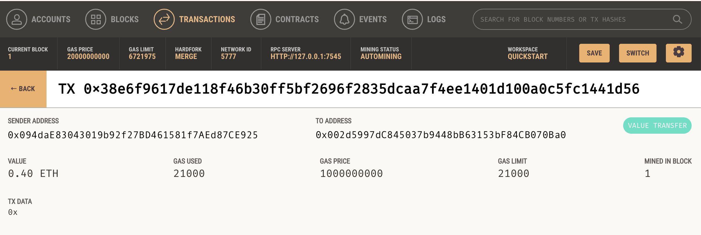

## Cryptocurrency Wallet

### Objective 
KryptoJobs2Go is an application that its customers can use to find fintech professionals from among a list of candidates, hire them, and pay them. It allows for integrating to the Ethereum blockchain network into an application that would enable  customers to instantly pay the fintech professionals whom they hire with cryptocurrency.

### Sample of Application 

### Sample of Ganache Transaction  

